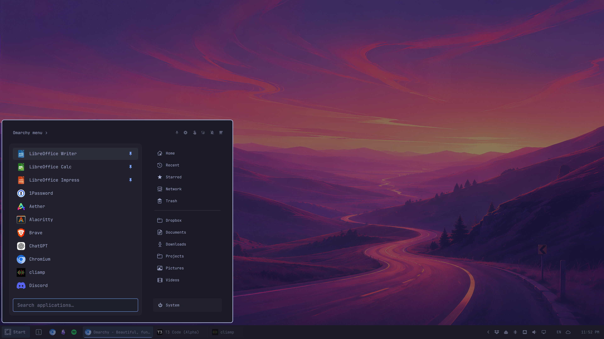

# Tilelane

A tiling desktop takes some getting used to. Tilelane gives Omarchy a familiar
taskbar and Start menu, so you can open your apps and get on with your day.
Start with the mouse and learn at your own pace.

Start has places for your folders, too. It picks up your bookmarks from Files,
alongside Home, Recent, and other built-in locations. Add a bookmark in Files,
and it appears in Start.

Right-click a task to see its window actions, with Omarchy's shortcuts beside
them. Use the menu today and try a shortcut next time. You don't have to learn
them all before you settle in.

Omarchy has your everyday apps ready to go. Hyprland still handles the tiling,
and the standard shortcuts keep working. Tilelane follows Omarchy's colors and
fonts, too. Pick a new theme, and the bar changes with it.



## Requirements

Tested on Omarchy 4.0.4 with Hyprland 0.56.2 and Qt 6.11.2.
Tilelane runs inside Omarchy's shell and uses its theme and fonts.

Runtime commands include Bash, `hyprctl`, `uwsm-app`, `gtk-launch`, and common
shell utilities. Floating-launch recovery also uses `jq` when available.
Start opens folders with Nautilus. Hosted Omarchy widgets keep their own dependencies.
See the full [command inventory](docs/architecture.md#processes-and-commands).

## Install

Install from GitHub and select Tilelane:

```sh
omarchy plugin add https://github.com/lexeko/tilelane.git
omarchy bar use io.github.lexeko.tilelane
```

### Manual installation

Place a complete copy in `~/.config/omarchy/plugins/io.github.lexeko.tilelane`.
Include `manifest.json`, `Bar.qml`, `qml/`, and `scripts/`.
Keep the scripts' executable permissions. Do not use a symlink.
Back up an existing installation before replacing it.

Then discover and select Tilelane:

```sh
omarchy plugin validate ~/.config/omarchy/plugins/io.github.lexeko.tilelane
omarchy-shell shell rescanPlugins
omarchy bar use io.github.lexeko.tilelane
```

## Turn it on or off

Select Tilelane:

```sh
omarchy bar use io.github.lexeko.tilelane
```

Return to Omarchy's built-in bar:

```sh
omarchy bar reset
```

## Use the taskbar

- Click an inactive task to focus its window. Click an active task to minimize it.
- Click a minimized task to restore it. It keeps its tiled or floating mode.
- Right-click a task for window actions. Right-click a pin to launch or reorder it.
- Tasks follow window opening order. Focus and minimize/restore do not reorder them.
- Pinned apps stay in place when the task list scrolls. Overflow controls reveal more tasks.
- Hover over the workspace button or tray chevron to reveal its contents.
- Start and taskbar pins are independent. Start applies a changed pin order on its next opening.
- Use search in Start to find and launch apps. Hover hints show how to pin apps
  or open apps and folders in floating windows.
- Taskbar controls accept clicks down to the bottom edge. Start reaches the left edge.
  The final status control reaches the right edge.

The bar appears at the bottom of each screen. Tasks include all workspaces on
that screen. Status controls appear on the first screen reported by Omarchy.

## Places in Start

Start includes Home, Recent, Starred, Network, and Trash. Below those, it shows
your bookmarks from Files, with the same names and order. Click a place to
open it in Files.

Manage these bookmarks in Files. Add, rename, reorder, or remove one, and Start
updates automatically. Places are separate from your pinned apps.

## Keyboard shortcuts

Window context menus show Omarchy's shortcuts beside the actions they perform.
Tilelane also keeps Omarchy's panel shortcuts working. It does not install or
rewrite Omarchy's bindings.

## Configure

Tilelane reads Omarchy's widget settings. For example:

```sh
omarchy bar set omarchy.clock format 'h:mm AP'
```

Use `omarchy plugin enable` and `omarchy plugin disable` for optional widgets.
Configured bar widgets appear automatically in the right-hand status area.
Tilelane follows the order within Omarchy's left, center, and right sections,
combining them in that order. Move a widget or change its settings with Omarchy:

```sh
omarchy bar move omarchy.clock --section right --index 0
omarchy bar set omarchy.clock format 'h:mm AP'
```

Changes apply without restarting the shell. Start, the workspace switcher,
and the task list stay in their Tilelane positions; the standard menu,
workspace, and indicator widgets are already represented there or inside Start.
Application tray icons continue to appear automatically in the tray drawer.

Existing status controls share Tilelane's hover, keyboard-focus, and panel
underline styling. Other plugins keep their own visual content and mouse
actions inside the shared host, so their internal styling may differ.
The bar stays at the bottom of the screen.

Tilelane saves taskbar pins, Start pins, identity overrides, and reduced motion
in Omarchy's `~/.config/omarchy/shell.json`. Changes apply without a restart.
See [settings and recovery](docs/recovery.md#recover-pins-or-settings) for the fields.

Set reduced motion with:

```sh
omarchy-shell tilelane reducedMotionSet true
omarchy-shell tilelane reducedMotionState
omarchy-shell tilelane reducedMotionSet false
```

Only `true` and `false` are accepted. This changes `bar.reducedMotion` in
Omarchy's settings.

## Update or remove

For a Git-managed installation with an upstream remote:

```sh
omarchy plugin update io.github.lexeko.tilelane
omarchy restart shell
```

A manually copied installation needs a new complete copy instead.
Do not overwrite its user data when updating plugin code.

To remove the installed plugin:

```sh
omarchy bar reset
omarchy plugin remove io.github.lexeko.tilelane
```

Tilelane's settings remain in `shell.json` after removal. See
[recovery](docs/recovery.md) for cleanup and minimized-window recovery.

## Documentation

- [Recovery and diagnostics](docs/recovery.md)
- [Changelog](CHANGELOG.md)
- [Architecture](docs/architecture.md)
- [Contributing](CONTRIBUTING.md)

## License

[MIT](LICENSE). Copyright (c) 2026 Alexey Konoplev.
